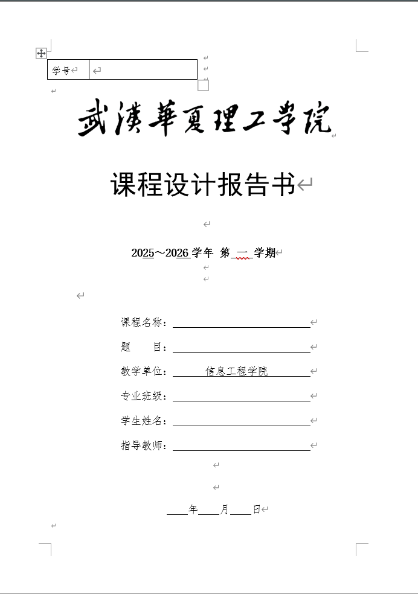
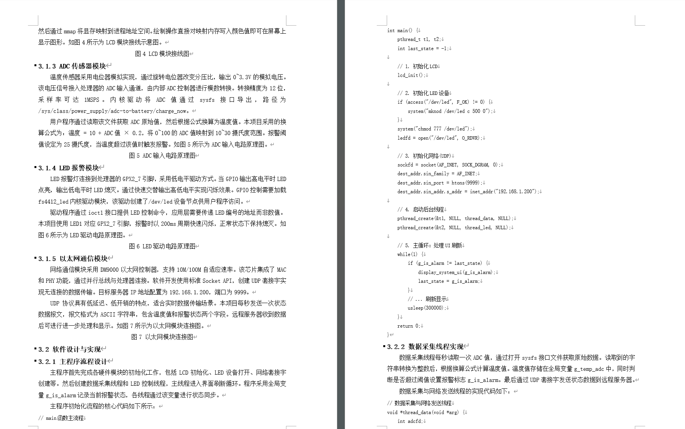
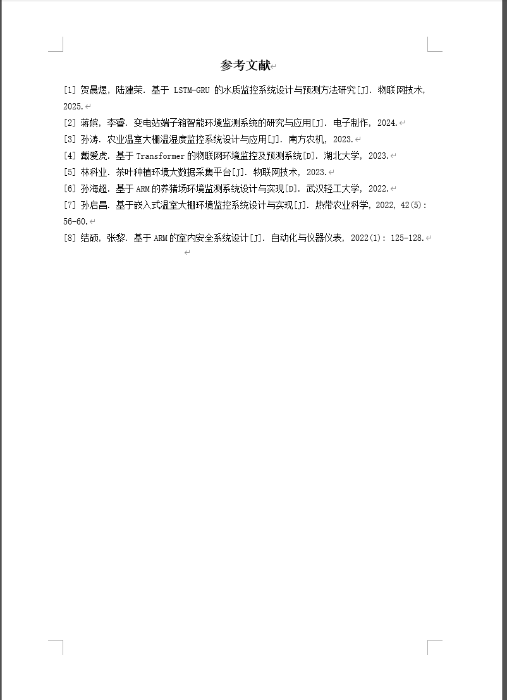

# Word Report Generator

> 一句话生成格式规范的 Word 课程设计报告 —— 专为被报告折磨的理工科同学打造。

## 还在被这些问题困扰吗？

**还在为 AI 编写的假参考文献烦恼吗？** 让 ChatGPT 帮你写参考文献，结果一查全是编造的期刊、不存在的作者、虚构的页码……老师一眼就看出来了。

**还在让 AI 生成报告然后反复 Ctrl+C / Ctrl+V 吗？** 从 AI 对话框里一段段复制，粘贴到 Word 里，然后手动调字体、改行距、设缩进、排封面、做目录……每次都要折腾两三个小时，报告内容可能十分钟就写完了，排版却耗掉了你一整个下午。

**Word Report Generator 让这一切成为历史。**

它是一个 [Claude Code](https://docs.anthropic.com/en/docs/claude-code) 的 Skill 插件。你只需要说一句话：

```
"帮我写一份课程设计报告"
```

剩下的全部自动完成：

- **分析参考模板** —— 自动提取老师给的模板章节结构，不用你手动对照
- **阅读项目源码** —— 直接读取你的代码，理解实现逻辑并写入报告
- **搜索真实文献** —— 通过知网自动获取 8 篇近 5 年的真实国内文献，告别假文献
- **生成完整报告** —— 封面、目录、正文、代码块、图片占位、参考文献，一步到位

最终输出一份 **格式严格规范** 的 `.docx` 文件，宋体五号字、1.25 倍行距、首行缩进两字符……全部自动搞定，直接打印提交。

## 效果预览

> 以下截图均来自实际生成的报告，所见即所得。

| 封面效果 | 正文排版 | 参考文献 |
|:--------:|:--------:|:--------:|
|  |  |  |

## 用之前 vs 用之后

| | 用之前 | 用之后 |
|------|--------|--------|
| **写内容** | AI 生成 → 手动复制粘贴 → 反复调整 | 一句话，自动生成完整 Word |
| **排版格式** | 手动调字体、行距、缩进、封面…… | 全部自动，严格符合学术规范 |
| **参考文献** | AI 编造假文献，查都查不到 | 知网实时搜索，真实可查 |
| **花费时间** | 2-3 小时排版 + 反复修改 | 几分钟，一步到位 |

## 核心特性

| 特性 | 说明 |
|------|------|
| **一句话触发** | 对 Claude 说"写报告"、"生成报告"即可自动启动 |
| **智能模板分析** | 自动提取参考文档的章节标题结构 |
| **源码理解** | 读取你的项目代码，提取关键实现写入报告 |
| **知网文献搜索** | 自动搜索并格式化 8 篇近 5 年真实国内文献 |
| **严格格式规范** | 宋体、五号字、1.25倍行距、首行缩进……全部自动搞定 |
| **图片占位符** | 自动预留图片位置，后续替换即可 |
| **评分表保留** | 自动保留模板中的评分表并移至末尾 |

---

## 安装指南

### 前置要求

| 依赖 | 要求 | 说明 |
|------|------|------|
| [Claude Code](https://docs.anthropic.com/en/docs/claude-code) | 最新版 | Anthropic 官方 CLI 工具 |
| Python | 3.7+ | 报告脚本运行环境 |
| python-docx | 最新版 | Word 文档生成库 |
| Chrome DevTools MCP | 可选 | 用于知网文献搜索 |

### 第一步：安装 Python 依赖

```bash
pip install python-docx
```

### 第二步：下载本项目

**方式一：Git Clone（推荐）**
```bash
git clone https://github.com/anjiu930/word-report-generator.git
```

**方式二：直接下载**

前往 [Releases 页面](https://github.com/anjiu930/word-report-generator/releases) 下载最新版本的 zip 包并解压。

### 第三步：复制 Skill 到 Claude Code

将 `word-report` 目录复制到 Claude Code 的 Skills 目录：

**Windows:**
```bash
xcopy /E /I word-report "%USERPROFILE%\.claude\skills\word-report"
```

**macOS / Linux:**
```bash
cp -r word-report ~/.claude/skills/word-report
```

复制完成后，目录结构应如下：

```
~/.claude/skills/
└── word-report/
    ├── SKILL.md
    ├── template.py
    ├── analyze_template.py
    └── examples/
        └── 课程设计报告书模板.docx
```

### 第四步：配置路径（重要）

安装后需要修改两个文件中的路径，使其匹配你的系统：

**1. 修改 `SKILL.md` 中的路径**

打开 `~/.claude/skills/word-report/SKILL.md`，将所有路径替换为你自己的：

```
# 把这个路径：
C:\Users\31930\.claude\skills\word-report\

# 替换为你的路径，例如：
C:\Users\你的用户名\.claude\skills\word-report\
# 或 macOS/Linux:
/Users/你的用户名/.claude/skills/word-report/
```

**2. 修改 `template.py` 中的路径**

打开 `~/.claude/skills/word-report/template.py`，修改前两行路径：

```python
# 修改为你想要的报告输出路径
OUTPUT_PATH = r"D:\report\word\项目报告.docx"

# 修改为你的 Skill 安装路径下的模板文件
TEMPLATE_PATH = r"C:\Users\你的用户名\.claude\skills\word-report\examples\课程设计报告书模板.docx"
```

### 第五步：注册 Skill

打开 Claude Code 的设置文件 `~/.claude/settings.local.json`，在 `allowedTools` 数组中添加：

```json
{
  "permissions": {
    "allowedTools": [
      "Skill(word-report)"
    ]
  }
}
```

或者在 Claude Code 中首次使用 `/word-report` 时，它会自动提示你授权。

### 第六步：验证安装

打开 Claude Code，输入：

```
帮我写一份课程设计报告
```

如果 Claude 回复询问你的项目路径和参考文档，说明安装成功！

---

## 使用方法

### 基本使用

只需要对 Claude 说出你的需求：

```
帮我写一份嵌入式课程设计报告，项目路径在 D:\MyProject
```

Claude 会自动执行以下流程：

```
① 分析参考模板 → ② 展示章节大纲 → ③ 确认后读取源码
→ ④ 搜索知网文献 → ⑤ 编写报告脚本 → ⑥ 生成 Word 文档
```

### 提供参考模板（可选）

如果你有老师给的特定报告模板：

```
帮我写报告，参考模板在 D:\模板\老师给的模板.docx，项目在 D:\MyProject
```

Skill 会自动提取模板中的章节标题，按照该结构生成报告。

### 使用自定义封面信息

在 `examples/课程设计报告书模板.docx` 中预先填写你的个人信息（学校、姓名、学号等），这样每次生成报告时封面就不用重复填了。

---

## 项目结构

```
word-report-generator/
├── README.md                        # 本文档
└── word-report/                     # Skill 核心目录（需复制到 Claude Code）
    ├── SKILL.md                     # Skill 定义文件（触发规则 + 执行流程）
    ├── template.py                  # 报告生成模板脚本（包含所有格式函数）
    ├── analyze_template.py          # 模板标题提取工具
    └── examples/
        └── 课程设计报告书模板.docx    # 默认 Word 模板
```

---

## 常见问题

<details>
<summary><b>Q: 生成报告时提示 "ModuleNotFoundError: No module named 'docx'"</b></summary>

运行以下命令安装依赖：
```bash
pip install python-docx
```
注意：包名是 `python-docx`，不是 `docx`。
</details>

<details>
<summary><b>Q: 报告生成失败，提示模板路径不存在</b></summary>

检查 `template.py` 中的 `TEMPLATE_PATH` 是否指向正确的模板文件路径。确保 `examples/课程设计报告书模板.docx` 文件存在于你的 Skill 安装目录中。
</details>

<details>
<summary><b>Q: 如何使用自己学校的报告模板？</b></summary>

将你的学校模板文件（.docx）放到 `examples/` 目录下，然后在使用时告诉 Claude 你的模板路径即可。Skill 会自动分析模板中的章节结构并按照该结构生成报告。
</details>

<details>
<summary><b>Q: 支持 macOS / Linux 吗？</b></summary>

支持！只需要将 `SKILL.md` 和 `template.py` 中的 Windows 路径替换为你系统对应的路径格式即可。例如：
```python
TEMPLATE_PATH = "/Users/yourname/.claude/skills/word-report/examples/课程设计报告书模板.docx"
```
</details>

<details>
<summary><b>Q: 不使用知网搜索文献可以吗？</b></summary>

可以。如果没有安装 Chrome DevTools MCP，Claude 会跳过自动文献搜索步骤。你可以手动提供参考文献列表，或者让 Claude 使用其他方式生成文献。
</details>

<details>
<summary><b>Q: 生成的报告字数不够 / 太多怎么办？</b></summary>

Skill 默认目标约 7000 字。你可以在对话中告诉 Claude 调整字数要求，例如："报告字数要求 5000 字左右"。
</details>

---

## 版本历史

| 版本 | 日期 | 主要变更 |
|------|------|----------|
| **v2.0** | 2026-03-14 | 大版本升级：新增 6 个函数、合并文档、完善 9 章示例结构 |
| v1.0 | 2026-01-01 | 初始版本 |

## 许可证

MIT License

## 致谢

- [python-docx](https://python-docx.readthedocs.io/) - Word 文档生成库
- [Claude Code](https://docs.anthropic.com/en/docs/claude-code) - Anthropic 官方 CLI 工具
